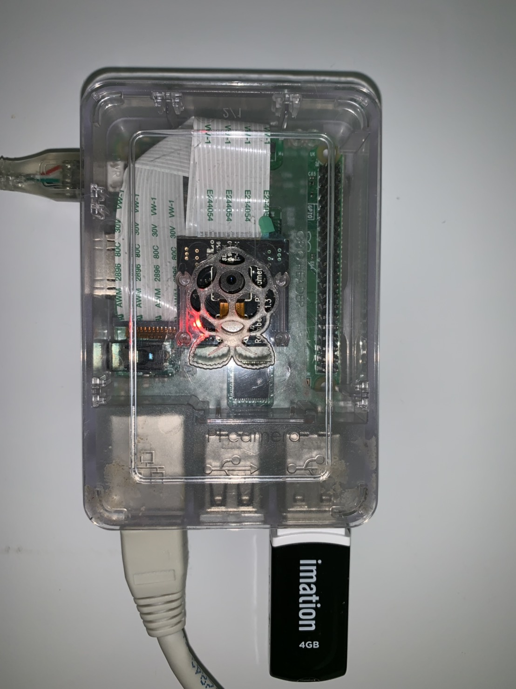

### PiCamera Web Streaming and Recording to staore in files on CSI interface (Python)
直接使用RaspBian Linux自帶庫(picamera)指令raspstill raspivid來控制攝像頭模組(CSI interface)。也可以直接在Python程序控制Pi Camera視頻, 同時將視頻流以每2分鐘(120sec.)儲存成一個視頻檔案或存到外部存儲裝置(USB disk), 這個庫有許多配置，可以改變亮度，對比度，影象效果，曝光模式等...這樣除了有瀏覽遠端攝像頭之外還有非常流行的行車記錄儀功能或公共場所之監控功能.

以目前畫面品質h264儲存檔案約1MB,若降低畫面品質將可以存儲更多資料,或是增加USB Disk容量都可以將存放天數增加.

外部存儲裝置USB disk 存放視頻檔案(.h264)循環存放,保留最近4天,可以循環利用存儲空間(存儲空間不足時會同時卡住Video Stream);

還有好多功能能加入
* 後續可自行加強增修它的移動偵測功能, 不用持續再持續性錄影, 以節省記憶體體空間;

* 加強存儲上的功能,存檔循環利用可以更細緻最小時間單位,或以USB記憶體容量作為依據,保留最近的影像視頻;

* 加強它的節電控制功能, 就可以達到移動偵測攝影的目的如夜行性動物攝影;

* 增強輔助功能如帶電燈控制或IO觸發控制,即時郵件通知,系統開機及運行,雲台控制...;

### 開始PiCamera案例準備事項
準備好你的樹梅派及攝像頭模組硬件(Raspberry Pi3 與Pi NoIR Camera V2 8MP)攝像頭模組它是透過FPC軟排與CSI介面連接,這樣可以全部放在一個機構殼中(FPC軟排不要經常插拔,它是僅有幾次的壽命,很容易接觸不良),當然也要準備電源+外加一隻USB Disk(錄影檔案是放在USD Disk,容量愈大存愈多,目前是存放4天至少需要一隻4GB USB Disk);同時,利用家中實體的網路線RJ45連接,再者最好申請一組公網IP,否則你只能在家中(內網)用瀏覽器觀看,公網IP會方便很多,可以遠端觀看IE瀏覽同時又可以運行VNC即時操作樹梅派

軟件就這一支了WebStreaming.py 創建好心的目錄後複製~$git clone https://github.com/louisopen/PiCameraRecordingCSI
運行~$python3 ./WebStreaming.py

### PiCamera控制方法
https://projects.raspberrypi.org/en/projects/getting-started-with-picamera/8

### 庫文件
picamera 庫文件(Raspberry Pi專有)記得安裝

sudo apt-get update

sudo apt-get upgrade

sudo apt-get install python3-picamera  #前一版... python-picamera

### Python程序用法：(匯入相關模組)
import picamera

from time import sleep

camera = picamera.PiCamera()    #初始化對象

camera.annotate_text = "Hello world"    #嵌入文字

camera.annotate_text_size = 32  #6~160 default:32

camera.resolution = (1024, 768) #解析度(長,寬)

camera.capture(‘image.jpg’) #捕獲影象存檔

camera.vflip = True #垂直翻轉

camera.hflip = True #水平翻轉

camera.rotation = 270   #0,90,180,270 另一種方法翻轉

camera.contrast = 50    #0~100 default:  對比度

camera.brightness = 65  #0~100 default:50 攝像頭亮度

camera.image_effect = 'colorswap'

camera.awb_mode = 'sunlight'   #白平衡模式

camera.exposure_mode = 'beach' #瀑光

camera.quality = 23 #1~40(low) quality品質

camera.annotate_background = picamera.Color('blue') #嵌入圖像底色

camera.annotate_foreground = picamera.Color('yellow')

camera.start_preview()  #開啟預覽

camera.start_recording(‘video.h264’)    #控制攝像頭錄影存檔

camera.start_recording(output, format='mjpeg')  #含視頻流控制

camera.start_recording('video'+ datetime.datetime.now().strftime('%m%d%H%M%S') +'.h264',format='h264', splitter_port=2, quality=30)  #視頻流存檔

camera.split_recording('video'+ self.nowtime.strftime('%m%d%H%M%S') +'.h264', splitter_port=2) #視頻流分割存檔

sleep(5)    #程式休眠，但攝像頭繼續工作

camera.stop_recording() #停止錄影

